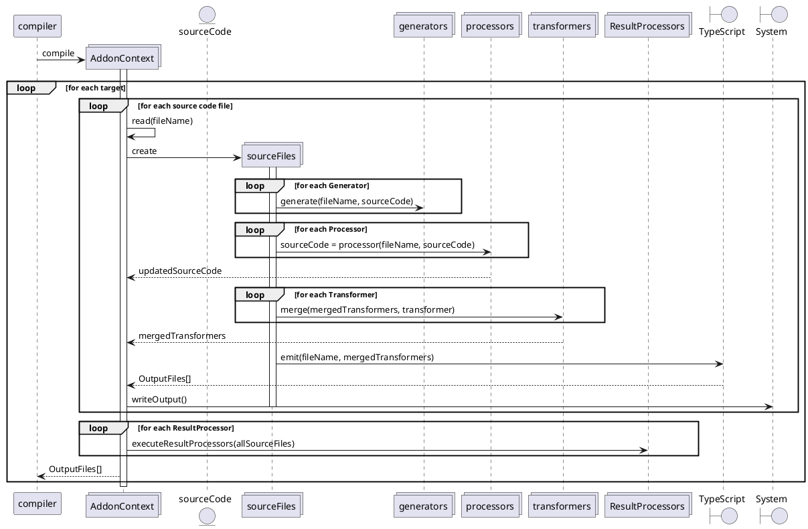

<!--
 @license

 Copyright (c) 2017-2022 Quatico Solutions AG
 Förrlibuckstrasse 220, 8005 Zurich, Switzerland

 All Rights Reserved.

 This software is the confidential and proprietary information of
 Quatico Solutions AG, ("Confidential Information"). You shall not
 disclose such Confidential Information and shall use it only in
 accordance with the terms of the license agreement you entered into
 with Quatico.
-->

# Write your own addon

The websmith compiler frontend provides an addon API to customize the compilation process of the underlying TypeScript compiler. An addon is an ES module named `addon.ts` or `addon.js` with an exported function named `activate`. The `activate` function  takes an `AddonContext` as its only parameter and is called when the compilation process is started. The `AddonContext` provides access to the underlying TypeScript compiler and API to register different kinds of transformers, processors or generators.
All addons must be located in separate folders inside the dedicated "addons" directory. The folder name is used as addon name, if no explicit name is provided. The "addons" directory should be located in the root of the project, i.e. next to your "tsconfig.json". The "addons" directory is not part of the TypeScript compilation process. You can specify a different location for your addons using the CLI argument `--addonsDir`.

## Different kinds of addons

The `AddonContext` provides several register methods to add different kinds of transformers, processors or generators to the compilation process. It's important to understand what kind to use for your purpose:

- `Generators` consume the unmodified source file and can create additional source input or other output files unrelated to the compilation process. They cannot alter the source code, giving every Generator the guarantee that they have unmodified source code as created by the developer.  Generators are executed per file, before all other Addon types and thus before the actual compilation.
- `Processors` consume source files possibly modified by prior processors, and input files created
by Generators. They are executed per file, after the `Generators` but before the standard TypeScript compilation. Processors allow you to alter aspects of the source that with TypeScripts CustomTransformers cannot be altered. A processor can modify the input files before the actual compilation, i.e., it can change module dependencies or add additional imports/exports.
- `Transformers` can be used to alter the generated JavaScript result during the JS emission phase. They are executed per file, after the `Processors` and are [standard TypeScript CustomTransformers](https://github.com/microsoft/TypeScript/wiki/Using-the-Compiler-API#traversing-the-ast-with-a-little-linter) that allow you to modify the code as the TypeScript to JavaScript transpilation takes place.
- `ResultProcessors` consume output files from the compilation process and can create additional files. They cannot alter the output files, but have access to the transformed source code and compilation results. ResultProcessors are executed after all other Addon types and the actual compilation is completed. All ResultProcessors are executed in order of their registration once for every target.

### What kind to use?

When implementing an addon, you should use the appropriate register method. For example, if you want to add a `Generator` to the compilation process, you should use the `registerGenerator` method. However, how to decide which kind to use? We recommend the following rule ot thumb:

- Use a `Generator` in your addon, when you want to generate information for a later addon, for your bundler, your deployment pipeline or the compiler itself. Generators are your choice if you need additional input files, or want to make sure you consume unmodified input files.
- Use a `Processor` in your addon, when you want to change the code that is passed into the compilation In particular, when you want to modify imports and exports. Processors are your choice if you need to modify existing input files or their dependencies before the actual compilation.
- Use a `Transformer` in your addon, when you want to change what the existing code in an input file does. Transformers are your choice if you need to modify code behavior.
- Use a `ResultProcessor` in your addon, when you want to post process the compilation output. Result processors are your choice if you need to create additional output files or an additional compilation result based on the based on your compilation output.

## Implement a Generator

`Generators` allow you to generate additional information **per file** with the unprocessed, untransformed input source files and persist them on the system (ctx.getSystem().writeFile(fileName)) for other addons that are executed later on (ctx.getSystem.readFile(fileName)).

### Example Generator

The following example shows how to implement a Generator that generates an additional input file for the compiler:

```typescript
// ./addons/example-generator/addon.ts
```

### Important Note

- The `Generator` is executed before all other Addon types and before the actual compilation.
- The `Generator` is executed once per file, not once per target.
- The `Generator` consumes the unmodified source file, regardless of how many other generators are executed before.
- The `Generator` can add new input files to the compilation process, using the `ctx.addInputFile()` method.

## Implement a Processor

`Processors` are executed **per file** before the TypeScript compilation step and allow you to alter all aspects of the code. `Processors` are in required in particular to add or remove imports, functions or dependencies on other modules. While this in theory can be done in `Transformers`, the TypeScript compilation will not be able to resolve such changes anymore yielding failing code when adding module dependencies and incorrect D.TS output files.
It is possible to use ts.Transform in `Processors` to reuse existing TypeScript CustomTransformers in this setup to achieve the desired code transformations.

### Example Processor

```typescript
// ./addons/example-processor/addon.ts
```

## Important Note

- The `Processor` is executed after all `Generators` and before the standard TypeScript compilation.
- The `Processor` is executed once per file, not once per target.
- The `Processor` can modify the input files before the actual compilation.
- The `Processor` can change module dependencies and modify imports/exports.

## Implement a Transformer

Transformers follow the standard TypeScript API `ts.CustomTransformers`, providing a factory that takes in a `ts.TransformationContext` and returning a Transformer for SourceFiles. While `Processors` are executed one by one, `Transformers` are merged. All **before** of all `Transformers` are executed together, all **after** are executed together and all **afterDeclarations** are executed together.

The official TypeScript has good examples for implementing a transformer, such as the [delint Transformer documentation](https://github.com/microsoft/TypeScript/wiki/Using-the-Compiler-API#traversing-the-ast-with-a-little-linter). Further examples and in-depth explanations for TypeScript code transformation can be found in the [TypeScript Transformer Handbook](https://github.com/madou/typescript-transformer-handbook).

When writing ts.Transform or Transformer based addons, we recommend to use [the AST Explorer](https://astexplorer.net/) and [the TS Creator](https://ts-creator.js.org/) as tools to aid your development.
VisualStudio Code users can leverage the extension [TypeScript AST Explorer](https://marketplace.visualstudio.com/items?itemName=krizzdewizz.vscode-typescript-ast-explorer).

#### Example Transformer

```typescript
// ./addons/example-transformer/addon.ts
```

### Important Note

- The `Transformer` is executed after all `Processors` as part of the standard TypeScript compilation.
- All `Transformers` are merged (before, after, afterDeclarations) and executed all together once per file, not once per target.
- The `Transformer` can modify the source code, but cannot change module dependencies or modify imports/exports.
- The `Transformer` follows the standard TypeScript API `ts.CustomTransformers`, providing a factory that takes in a `ts.TransformationContext` and returning a Transformer for SourceFiles.

The same TypeScript TransformerFactories we used in the `Processor` and `Generator` addons can also be used as `Transformer` addons.
But we must keep in mind, that `Transformer` addons are executed after TypeScript has processed the structure of code and in essence generated the D.TS file!
When using a `Processor` transformer in a `Transformer` addon, the resulting transformed JavaScript code will be identical to the `Processor` addon, but because we rewrite the signature of the functions (foobar1 to barfoo1 in above examples), the generated D.TS file will no longer match.

For the input

```typescript
export const foobar1 = (): string => {
    return "foobar1";
};
```

both Processor and Transformer addons yield the following JavaScript output

```typescript
export const barfoo1 = () => {
    return "foobar1";
};
```

but the Processor Addon will yield

**Processor .d.ts**

```typescript
export declare const barfoo1: () => string;
```

while the Transformer Addon will yield

**Transformer .d.ts**

```typescript
// The signature of foobar has not been transformed.
export declare const foobar1: () => string;
```

## Implement a ResultProcessor

ResultProcessor follow the same approach as `Generator` but are executed after the compilation has been finished.
The difference is that they are executed executed only once **per target**, not once **per file**.

### Example ResultProcessor

```typescript
// ./addons/example-result-processor/addon.ts
```

### Important Note

- The `ResultProcessor` is executed the compilation process is completed.
- The `ResultProcessor` is executed once per target, not once per file.
- The `ResultProcessor` can access the processed source file content, possibly modified by processors with `ctx.getFileContent()`
- The `ResultProcessor` can access the unmodified source file content with `ctx.getSystem().readFile()`

## Error reporting

Websmith uses a `Reporter` to communicate info, warning and error messages while respecting the current debug option. `context.getReporter()` can be used on the context in your activate function to access this reporter.

```typescript
export const createTransformer = (fileName: string, content: string, ctx: AddonContext): string => {
    if (content === "") {
        ctx.getReporter().reportDiagnostic(new ErrorMessage(`No content to transform for ${fileName}`));
        return "";
    }

    return executeTransformation(fileName, content, ctx);
};
```

## API

### Logging from addons: The reporter and messages

Websmith provides a global diagnostic reporter that you can use for addons both in the command line as well as the browser.

Out of the box, Websmith provides 3 default message types: `InfoMessage`, `WarnMessage` and `ErrorMessage`, which your addons can use to communicate diagnostic information.

#### Example

**example-generator/addon.ts**

```typescript
import { AddonContext, Generator, InfoMessage } from "@websmith/addon-api";
import ts from "typescript";

export const activate = (ctx: AddonContext) => {
    ctx.registerGenerator(createGenerator(ctx));
}

const createGenerator = (ctx: AddonContext): Generator =>
    (fileName: string, fileContent: string): void => {
        const sf = ts.createSourceFile(fileName, fileContent, ctx.getConfig().options?.target ?? ts.ScriptTarget.Latest);
        ctx.getReporter().reportDiagnostic(new InfoMessage(`Example Addon processing ${fileName}`, sf));
    }
```

### Interacting with Websmith: The AddonContext explained

Websmith addons receive the `AddonContext` in the `activate` function.
The `AddonContext` provides the necessary API for addons to access

- the file system
- the current compilation program
- the reporter

as well as requesting

- the configuration of the current compilation
- the current target
- the up to date input file content.

### Interacting with the file system

To enable your addons to work locally as well in the browser environment, it is important to not use the filesystem but use the provided ts.System instead!

You can get access to the system through ctx.getSystem() and execute your file operations from any addon:

TBD

## Addon execution flow


