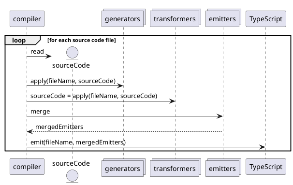

# Write your own addon

Inside your addons directory, create a directory that contains a file `addon.ts`. This file is called the addon activator and it requires a function `activate(ctx: CompilationContext)`. The activator is called before the compilation process to register the addon in the appropriate step during the compilation process.

You can register three kinds of addons: `Generator`, `Transformer` and `Emitter`.

- `Generators` can be used to create additional files (eg documentation) based on your source code files.
- `Transformer` can be used to alter a source input file during the compilation.
- `Emitter` can be used to alter the generated JavaScript result during the JS emission phase.

... your addon can use external dependencies ...

- import dependencies and add them as devDependencies to your package.json.
  - those are not included in the compilation of your target code

... The structure of your addon folder is up to you, websmith interacts only with the addon activator ...
... The addon directory is not subject to the addon compilation process ...

## Choose your addon kind

- `Generators` are executed before transformers. They can not alter the source code, ensuring that the generators can act upon the unmodified code as created by the developer.
- `Transformers` are executed before the standard TypeScript compilation and allow you to alter the source code to alter/add/remove aspects that with TypeScripts CustomTransformers are not possible anymore. Examples: adding and removing imports, exports or functions.
- `Emitters` are [standard TypeScript CustomTransformers](https://github.com/microsoft/TypeScript/wiki/Using-the-Compiler-API#traversing-the-ast-with-a-little-linter) that allow you to modify the code as the TypeScript to JavaScript transpilation takes place. By their nature, CustomTransformers executed during TypeScript Emit can not alter the signature of existing code anymore. If you wish to do that, you can use your transformer with the ts.Transform function with `PreEmit Transformers`.

### Addon execution flow



### Generator

- `Generators` are executed before the compilation and enable you to act upon the unaltered input source code.

#### Example: export-collector

The goal of the export collector is to collect all exported functions and list them in a YAML. This output can be consumed by other tools as part of a delivery process for security audit, generating additional data like processing (s)css or documentation.

**exportCollector/addon.ts**

```javascript
import type { AddonContext } from "@websmith/addon-api";
import { createExportCollector } from "./export-collector";

export const activate = (ctx: AddonContext) => {
    ctx.registerGenerator((fileName, content) => createExportCollector(fileName, content, ctx));
}
```

**exportCollector/export-collector.ts**

```javascript
import { existsSync, readFileSync, writeFileSync } from "fs";
import { resolve } from "path";
import ts from "typescript";
import type { AddonContext } from "@websmith/addon-api";
import { ErrorMessage } from "@websmith/addon-api"; 

export const createExportCollector = (fileName: string, content: string, ctx: AddonContext): void => {
    const sf = ts.createSourceFile(fileName, content, ctx.getConfig().options.target ?? ts.ScriptTarget.Latest, true);
    const transformResult = ts.transform(sf, [createExportCollectorFactory()], ctx.getConfig().options);

    if (transformResult.diagnostics && transformResult.diagnostics.length > 0) {
        transformResult.diagnostics.forEach(it => ctx.getReporter().reportDiagnostic(new ErrorMessage(it.messageText, sf)));
    }

    if (transformResult.transformed.length < 1) {
        ctx.getReporter().reportDiagnostic(new ErrorMessage(`exportCollector failed for ${fileName} without identifiable error.`, sf));
    }
};

const createExportCollectorFactory = () => {
    return (ctx: ts.TransformationContext): ts.Transformer<ts.SourceFile> => {
        return (sf: ts.SourceFile) => {
            const exportFileContent = getOrCreateOutputFile(resolve("./output.yaml"));
            const foundDeclarations: string[] = [];

            const visitor = (node: ts.Node): ts.VisitResult<ts.Node> => {
                if (ts.isSourceFile(node)) {
                    return ts.visitEachChild(node, visitor, ctx);
                }

                if (
                    node.modifiers?.some(it => it.kind === ts.SyntaxKind.ExportKeyword) &&
                    (ts.isVariableStatement(node) || ts.isFunctionDeclaration(node))
                ) {
                    foundDeclarations.push(getIdentifier(node));
                }

                return node;
            };

            sf = ts.visitNode(sf, visitor);

            writeFileSync(resolve("./output.yaml"), getYAMLOutput(exportFileContent, sf.fileName, foundDeclarations));
            return sf;
        };
    };
};

const getYAMLOutput = (exportFileContent: string, fileName: string, foundDeclarations: string[]): string => {
    const existingFileContent = exportFileContent ? exportFileContent + "\n" : "";
    const exportedDeclarations = foundDeclarations.length > 0 ? `\nexports: [${foundDeclarations.join(",")}]\n` : "";
    return `${existingFileContent}-file: "${fileName}"${exportedDeclarations}`;
};

const getIdentifier = (node: ts.FunctionDeclaration | ts.VariableStatement): string => {
    if (ts.isFunctionDeclaration(node)) {
        return node.name?.getText() ?? "unknown";
    } else if (ts.isVariableStatement(node)) {
        return node.declarationList?.declarations[0]?.name?.getText() ?? "unknown";
    }
    return "";
};

const getOrCreateOutputFile = (fileName: string): string => {
    if (!existsSync(fileName)) {
        writeFileSync(fileName, "");
    }
    return readFileSync(fileName).toString();
};
```

### Transformer

`Transformers` are execute before the TypeScript compilation step and allow you to alter all aspects of the code. Transformers are in required in particular to add or remove imports, functions or dependencies on other modules. While this can in theory be done in `Emitters`, the TypeScript compilation will not be able to resolve such changes anymore yielding failing code when adding module dependencies and incorrect D.TS output files.
It is possible to use ts.Transform in `Transformers` to reuse existing TypeScript CustomTransformers in this setup to achieve the desired code transformations.

> Note: Transformers are executed one by one unlike Emitters that are merged and yield a single TypeScript execution.

**foobarReplacer/addon.ts**

```javascript
import type { AddonContext } from "@websmith/addon-api";
import { createFoobarReplacerTransformer } from "./foobar-replacer";

export const activate = (ctx: AddonContext): void => {
    ctx.registerPreEmitTransformer((fileName, content) => createFoobarReplacerTransformer(fileName, content, ctx));
};

```

**foobarReplacer/foobar-replacer.ts**

```javascript
import ts from "typescript";
import type { AddonContext } from "@websmith/addon-api";
import { ErrorMessage } from "@websmith/addon-api"; 

export const createFoobarReplacerTransformer = (fileName: string, content: string, ctx: AddonContext): string => {
    const sf = ts.createSourceFile(fileName, content, ctx.getConfig().options.target ?? ts.ScriptTarget.Latest, true);
    const transformResult = ts.transform(sf, [createFoobarReplacerFactory()], ctx.getConfig().options);
    if (transformResult.diagnostics && transformResult.diagnostics.length > 0) {
        transformResult.diagnostics.forEach(it => ctx.getReporter().reportDiagnostic(new ErrorMessage(it.messageText, sf)));
        return "";
    }

    if (transformResult.transformed.length > 0) {
        return ts.createPrinter().printFile(transformResult.transformed[0]);
    }

    ctx.getReporter().reportDiagnostic(new ErrorMessage(`foobarReplacer failed for ${fileName} without identifiable error.`, sf));
    return "";
};

export const createFoobarReplacerFactory = () => {
    return (ctx: ts.TransformationContext): ts.Transformer<ts.SourceFile> => {
        return (sf: ts.SourceFile) => {
            const visitor = (node: ts.Node): ts.VisitResult<ts.Node> => {
                if (ts.isSourceFile(node)) {
                    return ts.visitEachChild(node, visitor, ctx);
                }

                if (ts.isIdentifier(node)) {
                    const identifier = node.getText();
                    if (identifier.match(/foobar/gi)) {
                        return ctx.factory.createIdentifier(identifier.replace(/foobar/gi, "barfoo"));
                    }
                    if (identifier.match(/barfoo/gi)) {
                        return ctx.factory.createIdentifier(identifier.replace(/barfoo/gi, "foobar"));
                    }
                }

                return ts.visitEachChild(node, visitor, ctx);
            };

            return ts.visitNode(sf, visitor);
        };
    };
};
```

### Emitter

Emitters follow the standard TypeScript `ts.CustomTransformers` approach, providing a factory that takes in a TransformationContext and returning a Transformer for SourceFiles.

**foobarReplaceEmitter/addon.ts**

```javascript
import { AddonContext } from "@websmith/addon-api";
import { createFoobarReplacerFactory } from "../foobarReplacer/foobar-replacer";

export const activate = (ctx: AddonContext): void => {
    ctx.registerEmitTransformer({ before: [createFoobarReplacerFactory()] });
};
```

#### Important Note

The same TypeScript TransformerFactories we used in the Transformer and Generator addons above can also be used Emitter addons as we did before.
But we must keep in mind, that Transformer addons are executed after TypeScript has parsed the code and in essence generated the D.TS file. When using the foobarReplacer Factory for an Emitter plugin as shown above, the resulting transformed JavaScript code will be identical to the Transformer Addon, but because we rewrite the signature of the functions, the generated D.TS file will no longer match.

For the input

```javascript
export const foobar1 = ():string => {
    return "foobar1";
}
```

both Transformer and Emitter addons yield the following JavaScript output

```javascript
export const barfoo1 = () => {
    return "foobar1";
}
```

but the Transformer Addon will yield

**Transformer .d.ts**

```javascript
export declare const barfoo1: () => string;
```

while the Emitter Addon will yield

**Emitter .d.ts**

```javascript
// The signature of foobar has not been transformed.
export declare const foobar1: () => string;
```

### Additional Examples and Information

The official TypeScript has additional examples, for example [a delint Transformer documentation](https://github.com/microsoft/TypeScript/wiki/Using-the-Compiler-API#traversing-the-ast-with-a-little-linter).

Further examples and indepth explanations for TypeScript code transformation can be found in the [TypeScript Transformer Handbook](https://github.com/madou/typescript-transformer-handbook).

Keeping [the AST Explorer](https://astexplorer.net/) and [the TS Creator](https://ts-creator.js.org/) at hand to support you is advisable.
VisualStudio Code users can leverage the extension [TypeScript AST Explorer](https://marketplace.visualstudio.com/items?itemName=krizzdewizz.vscode-typescript-ast-explorer).

## Error reporting

Websmiths AddonContext provides a Reporter through getReporter() that allows you to report Info, Warn and Error messages in your Generator and Transformer addons.

```javascript
export const createTransformer = (fileName: string, content: string, ctx: AddonContext): string => {
    if(content === "") {
        ctx.getReporter().reportDiagnostic(new ErrorMessage(`No content to transform for ${fileName}`));
        return "";
    }

    return executeTransformation(fileName, content, ctx);
}
```

## How to interact with the compiler: CompilationContext and Reporter explained

```javascript
interface AddonContext {
    getSystem(): ts.System;
    getConfig(): ts.ParsedCommandLine;
    getCompilationOptions(): unknown;
    getReporter(): Reporter;

    registerGenerator(...);
    registerTransformer(...);
    registerEmitters(...);
    // Add link to typescript transformer and transformer handbook
}

interface Reporter {
    reportDiagnostic(DiagnosticMessage): void
}

// Possible types of DiagnosticMessages you can create
class ErrorMessage extends DiagnostcMessage {}
class WarnMessage extends DiagnosticMessage {}
class InfoMessage extends DiangnosticMessage {}
```
