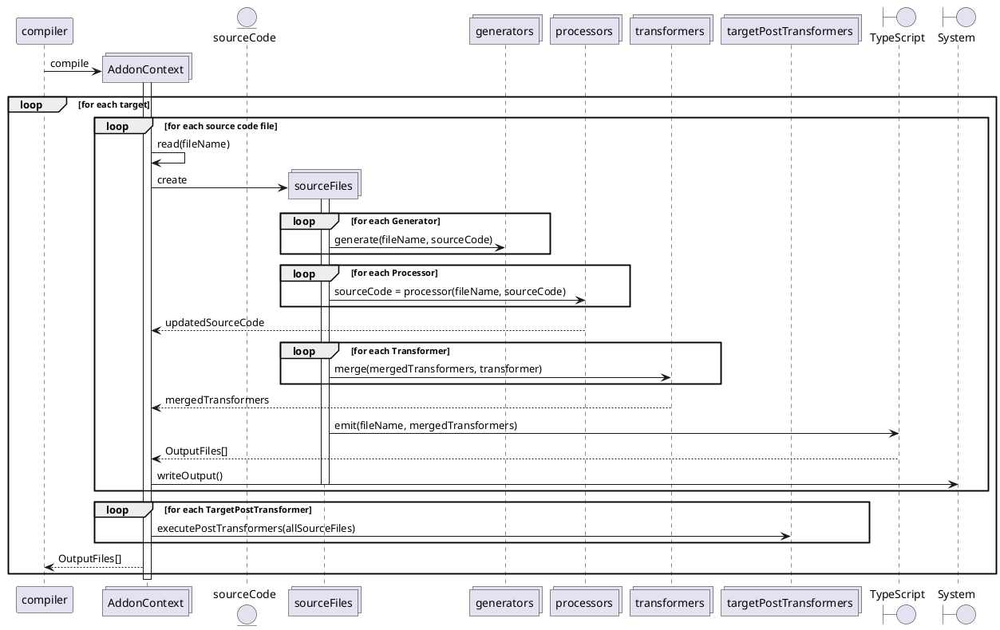

<!--
 @license

 Copyright (c) 2017-2022 Quatico Solutions AG
 Förrlibuckstrasse 220, 8005 Zurich, Switzerland

 All Rights Reserved.

 This software is the confidential and proprietary information of
 Quatico Solutions AG, ("Confidential Information"). You shall not
 disclose such Confidential Information and shall use it only in
 accordance with the terms of the license agreement you entered into
 with Quatico.
-->

# Write your own addon

Inside your addons directory, create a directory that contains a file `addon.ts`. This file is called the addon activator and it requires a function `activate(ctx: AddonContext)`. The activator is called before the compilation process to register the addon in the appropriate step during the compilation process.

You can register several kinds of addons: `Generator`, `Processor`, `Transformer` and `TargetPostTransformer`

- `Generators` can be used to create additional files (eg documentation) based on your source code files.
- `Processor` can be used to alter a source input file during the compilation.
- `Transformer` can be used to alter the generated JavaScript result during the JS emission phase.
- `TargetPostTransformer` can be used to execute project wide functionality after the compilation has finished.

## Choose your addon kind

- `Generators` (**per file**) are executed first. Generators can not alter the source code, giving every Generator the guarantee that they have unmodified source code as created by the developer.
- `Processors` (**per file**) are executed after `Generators` but before the standard TypeScript compilation and allow you to alter the source code to alter aspects that with TypeScripts CustomTransformers can no longer be altered.
- `Transformers` (**per file**) are executed after `Processors` and are [standard TypeScript CustomTransformers](https://github.com/microsoft/TypeScript/wiki/Using-the-Compiler-API#traversing-the-ast-with-a-little-linter) that allow you to modify the code as the TypeScript to JavaScript transpilation takes place.
- `TargetPostTransformers` (**per compilation target**) are executed after the compilation has finished. `TargetPostTransformers` can not alter the source code but have access to the transformed source code and compilation results.

### Rule of thumb

> Use a `Generator` addon, when you want to generate information for a later addon, for your bundler, your deployment pipeline or your deployment environment.
>
> Use a `Processor` addon, when you want to change what code is present! In particular: imports and exports!
>
> Use a `Transformer` addon, when you want to change what existing code does!
>
> Use a `TargetPostTransformer` addon, when you want to execute an operation for a target as a whole with the transformed state.

### Generator

`Generators` allow you to generate additional information **per file** with the unprocessed, untransformed input source files and persist them on the system (ctx.getSystem().writeFile(fileName)) for other addons that are executed later on (ctx.getSystem.readFile(fileName)).

#### Example: export-yaml-generator

The goal of the export collector is to collect all exported functions and list them in a YAML. This output can be consumed by other tools as part of a delivery process for security audit, generating additional data like processing (s)css or documentation.

**export-yaml-generator/addon.ts**

```typescript
import { AddonContext, ErrorMessage, Generator } from "@websmith/addon-api";
import ts from "typescript";
import { createTransformer, resetOutput } from "./export-transformer";

/**
 * Registers the generator for the given addon context.
 *
 * @param ctx AddonContext for the compilation.
 */
export const activate = (ctx: AddonContext): void => {
    ctx.registerGenerator(createGenerator(ctx));
};

/**
 * Generator for the export-yaml-generator addon.
 *
 * @param ctx
 * @returns A websmith generator factory function.
 */
const createGenerator =
    (ctx: AddonContext): Generator =>
    (fileName: string, fileContent: string): void => {
        const file = ts.createSourceFile(fileName, fileContent, ctx.getConfig().options.target ?? ts.ScriptTarget.Latest, true);
        const result = ts.transform(file, [createTransformer(ctx.getSystem())], ctx.getConfig().options);

        if (result.diagnostics && result.diagnostics.length > 0) {
            result.diagnostics.forEach(it => ctx.getReporter().reportDiagnostic(new ErrorMessage(it.messageText, file)));
        }

        if (result.transformed.length < 1) {
            ctx.getReporter().reportDiagnostic(new ErrorMessage(`exportCollector failed for ${fileName} without identifiable error.`, file));
        }
    };
```

**export-yaml-generator/export-transformer.ts**

```typescript
import { existsSync, mkdirSync, readFileSync, writeFileSync } from "fs";
import { dirname } from "path";
import ts from "typescript";

/**
 * Target file path for the generated export file.
 */
const OUTPUT_FILE_PATH = "lib/output.yaml";

/**
 * Creates a transformer that collects all names of exported functions and variables.
 *
 * @param system The TS system to use.
 * @returns A TS transformer factory.
 */
export const createTransformer = (system: ts.System): ts.TransformerFactory<ts.SourceFile> => {
    return (ctx: ts.TransformationContext): ts.Transformer<ts.SourceFile> => {
        return (input: ts.SourceFile): ts.SourceFile => {
            const foundDecls: string[] = [];

            const visitor = (node: ts.Node): ts.VisitResult<ts.Node> => {
                // Visit child nodes of source files
                if (ts.isSourceFile(node)) {
                    return ts.visitEachChild(node, visitor, ctx);
                }

                // Collect node identifier if it is exported and a function or variable
                if (
                    node.modifiers?.some(it => it.kind === ts.SyntaxKind.ExportKeyword) &&
                    (ts.isVariableStatement(node) || ts.isFunctionDeclaration(node))
                ) {
                    foundDecls.push(getName(node));
                }

                return node;
            };

            input = ts.visitNode(input, visitor);

            // Write collected identifiers to hard coded output file
            writeFileSync(system.resolvePath(OUTPUT_FILE_PATH), createFileContent(input.fileName, foundDecls, system));
            return input;
        };
    };
};

/**
 * Appends the given names to the output file.
 *
 * @param filePath The path to the file.
 * @param names The names to append.
 * @param system The TS system to use.
 * @returns The new content to append to the file.
 */
const createFileContent = (filePath: string, names: string[], system: ts.System): string => {
    const fileContent = getOrCreateFile(system.resolvePath(OUTPUT_FILE_PATH));
    const existingFileContent = fileContent ? `${fileContent}\n` : "";
    const exports = names.length > 0 ? `\nexports: [${names.join(",")}]\n` : "";
    return `${existingFileContent}-file: "${filePath}"${exports}`;
};

/**
 * Returns identifier for function or variable declaration, or empty string for nodes of different types.
 *
 * @param node The node to get the name from.
 * @returns Node name or empty string.
 */
const getName = (node: ts.Node): string => {
    if (ts.isFunctionDeclaration(node)) {
        return node.name?.getText() ?? "unknown";
    } else if (ts.isVariableStatement(node)) {
        return node.declarationList?.declarations[0]?.name?.getText() ?? "unknown";
    }
    return "";
};

/**
 * Returns the content of the file or creates a new file if it does not exist.
 *
 * @param filePath The path to the file.
 * @returns The content of the file or empty string if the file does not exist.
 */
const getOrCreateFile = (filePath: string): string => {
    if (!existsSync(dirname(filePath))) {
        mkdirSync(dirname(filePath), { recursive: true });
    }
    if (!existsSync(filePath)) {
        writeFileSync(filePath, "");
    }
    return readFileSync(filePath).toString();
};
```

### Processors

`Processors` are execute before the TypeScript compilation step and allow you to alter all aspects of the code. `Processors` are in required in particular to add or remove imports, functions or dependencies on other modules. While this can in theory be done in `Transformers`, the TypeScript compilation will not be able to resolve such changes anymore yielding failing code when adding module dependencies and incorrect D.TS output files.
It is possible to use ts.Transform in `Processors` to reuse existing TypeScript CustomTransformers in this setup to achieve the desired code transformations.

#### Example: foobar-replace-processor

**foobar-replace-processor/addon.ts**

```typescript
import { AddonContext, ErrorMessage, Processor } from "@websmith/addon-api";
import ts from "typescript";
import { createTransformer } from "./foobar-transformer";

export const activate = (ctx: AddonContext): void => {
    ctx.registerProcessor(createProcessor(ctx));
};

/**
 * Creates a processor that uses a TS transformer to replace every found "foobar" identifier with "barfoo".
 *
 * @param ctx The addon context for the compilation.
 * @returns A websmith processor factory function.
 */
const createProcessor =
    (ctx: AddonContext): Processor =>
    (fileName: string, content: string): string => {
        const file = ts.createSourceFile(fileName, content, ctx.getConfig().options.target ?? ts.ScriptTarget.Latest, true);
        const result = ts.transform(file, [createTransformer()], ctx.getConfig().options);
        if (result.diagnostics && result.diagnostics.length > 0) {
            result.diagnostics.forEach(it => ctx.getReporter().reportDiagnostic(new ErrorMessage(it.messageText, file)));
            return "";
        }
        if (result.transformed.length > 0) {
            return ts.createPrinter().printFile(result.transformed[0]);
        }
        ctx.getReporter().reportDiagnostic(new ErrorMessage(`Foobar-Replacer failed for ${fileName} without identifiable error.`, file));
        return "";
    };
```

**foobar-replace-processor/foobar-transformer.ts**

```typescript
import ts from "typescript";

/**
 * Create a transformer that replaces every "foobar" identifier with "barfoo".
 *
 * @returns A TS transformer factory.
 */
export const createTransformer = (): ts.TransformerFactory<ts.SourceFile> => {
    return (ctx: ts.TransformationContext): ts.Transformer<ts.SourceFile> => {
        return (sf: ts.SourceFile) => {
            const visitor = (node: ts.Node): ts.VisitResult<ts.Node> => {
                // Visit child nodes of source files
                if (ts.isSourceFile(node)) {
                    return ts.visitEachChild(node, visitor, ctx);
                }
                // Replace foobar with barfoo identifiers
                if (ts.isIdentifier(node)) {
                    const identifier = node.getText();
                    if (identifier.match(/foobar/gi)) {
                        return ctx.factory.createIdentifier(identifier.replace(/foobar/gi, "barfoo"));
                    }
                    if (identifier.match(/barfoo/gi)) {
                        return ctx.factory.createIdentifier(identifier.replace(/barfoo/gi, "foobar"));
                    }
                }
                return ts.visitEachChild(node, visitor, ctx);
            };
            return ts.visitNode(sf, visitor);
        };
    };
};
```

### Transformer

Transformer follow the standard TypeScript `ts.CustomTransformers` approach, providing a factory that takes in a TransformationContext and returning a Transformer for SourceFiles.

#### Important Note

> While `Processors` are executed one by one, `Transformers` are merged. All **before** of all `Transformers` are executed together, all **after** are executed together and all **afterDeclarations** are executed together.

#### Example: foobar-replace-transformer

**foobar-replace-transformer/addon.ts**

```typescript
import { AddonContext } from "@websmith/addon-api";
import ts from "typescript";

export const activate = (ctx: AddonContext): void => {
    ctx.registerTransformer({ before: [createTransformer()] });
};

/**
 * Create a transformer that replaces every "foobar" identifier with "barfoo".
 *
 * @returns A TS transformer factory.
 */
export const createTransformer = (): ts.TransformerFactory<ts.SourceFile> => {
    return (ctx: ts.TransformationContext): ts.Transformer<ts.SourceFile> => {
        return (sf: ts.SourceFile) => {
            const visitor = (node: ts.Node): ts.VisitResult<ts.Node> => {
                // Visit child nodes of source files
                if (ts.isSourceFile(node)) {
                    return ts.visitEachChild(node, visitor, ctx);
                }
                // Replace foobar with barfoo identifiers
                if (ts.isIdentifier(node)) {
                    const identifier = node.getText();
                    if (identifier.match(/foobar/gi)) {
                        return ctx.factory.createIdentifier(identifier.replace(/foobar/gi, "barfoo"));
                    }
                    if (identifier.match(/barfoo/gi)) {
                        return ctx.factory.createIdentifier(identifier.replace(/barfoo/gi, "foobar"));
                    }
                }
                return ts.visitEachChild(node, visitor, ctx);
            };
            return ts.visitNode(sf, visitor);
        };
    };
};
```

#### Important Note

The same TypeScript TransformerFactories we used in the `Processor` and `Generator` addons can also be used as `Transformer` addons.
But we must keep in mind, that `Transformer` addons are executed after TypeScript has processed the structure of codee and in essence generated the D.TS file!
When using a `Processor` transformer in a `Transformer` addon, the resulting transformed JavaScript code will be identical to the `Processor` addon, but because we rewrite the signature of the functions (foobar1 to barfoo1 in above examples), the generated D.TS file will no longer match.

For the input

```typescript
export const foobar1 = (): string => {
    return "foobar1";
};
```

both Processor and Transformer addons yield the following JavaScript output

```typescript
export const barfoo1 = () => {
    return "foobar1";
};
```

but the Processor Addon will yield

**Processor .d.ts**

```typescript
export declare const barfoo1: () => string;
```

while the Transformer Addon will yield

**Transformer .d.ts**

```typescript
// The signature of foobar has not been transformed.
export declare const foobar1: () => string;
```

### TargetPostTransformer

TargetPostTransformer follow the same approach as `Generator` but are executed after the compilation has been finished.
The difference is that they are executed executed only once **per target**, not once **per file**.

#### Example: tag-collector-transformer

**tag-collector-transformer/addon.ts**

```typescript
import { AddonContext, TargetPostTransformer } from "@websmith/addon-api";
import ts from "typescript";
import { createTransformerFactory, getOutputFilePath } from "./target-post-transformer";

export const activate = (ctx: AddonContext) => {
    ctx.registerTargetPostTransformer(createTargetPostTransformer(ctx));
};

/**
 * Creates a TargetPostProcessor that collects all functions and arrow functions with a // @service() comment.
 *
 * @param fileNames The file names of the current target to process.
 * @param ctx The addon context for the compilation.
 * @returns A websmith TargetPostTransformer factory function.
 */
const createTargetPostTransformer =
    (ctx: AddonContext): TargetPostTransformer =>
    (fileNames: string[]): void => {
        const outDir = ctx.getConfig().options.outDir ?? process.cwd();
        ctx.getSystem().writeFile(getOutputFilePath(outDir), "");
        fileNames
            .filter(fn => fn.match(/\.tsx?/gi))
            .map(fn => {
                const sf = ts.createSourceFile(fn, ctx.getFileContent(fn), ctx.getConfig().options.target ?? ts.ScriptTarget.Latest);
                ts.transform(sf, [createTransformerFactory(ctx.getSystem(), outDir)], ctx.getConfig().options);
            });
    };
```

**tag-collector-transformer/target-post-transformer.ts**

```typescript
import { join } from "path";
import ts from "typescript";

/**
 * Gets the output file path for the given output directory.
 *
 * @param outputDirectory The output directory for the generated files.
 * @returns The output file path.
 */
export const getOutputFilePath = (outputDirectory: string) => join(outputDirectory, "annotatedFunctions.yaml");

/**
 * Create a transformer that collects all functions and arrow functions with a // @service() comment.
 *
 * @param sys The ts.System for the transformation.
 * @param outputDirectory The output directory for the generated files.
 * @returns A TS TransformerFactory.
 */
export const createTransformerFactory = (sys: ts.System, outputDirectory: string): ts.TransformerFactory<ts.SourceFile> => {
    return (ctx: ts.TransformationContext): ts.Transformer<ts.SourceFile> => {
        return (sf: ts.SourceFile) => {
            const outputNames = readOutputNames(sys, outputDirectory);

            const visitor = (node: ts.Node): ts.VisitResult<ts.Node> => {
                if (ts.isSourceFile(node)) {
                    ts.visitEachChild(node, visitor, ctx);
                }

                if (isAnnotated(node, sf)) {
                    addFunctionNameToOutput(node, outputNames, sf);
                }

                return node;
            };

            sf = ts.visitNode(sf, visitor);

            sys.writeFile(getOutputFilePath(outputDirectory), `${outputNames.join("\n")}`);
            return sf;
        };
    };
};

/**
 * Checks if the given node is annotated with a // @annotated() comment.
 *
 * @param node The node to check.
 * @param sf The source file that contains the node.
 * @returns True if the node is annotated with a @annotated() comment.
 */
const isAnnotated = (node: ts.Node, sf: ts.SourceFile) => {
    return node.getFullText(sf).match(/\/\/.*@annotated\(.*\)/gi);
};

/**
 * Gets the name of the given variable statement.
 *
 * @param variableStatement The TS VariableStatement to get the name from.
 * @param sf The TS SourceFile that contains this variable statement.
 * @returns The name of the variable in the given statement.
 */
const getVariableName = (variableStatement: ts.VariableStatement, sf: ts.SourceFile): string => {
    return variableStatement.declarationList.declarations[0].name.getText(sf);
};

/**
 * Gets the name of the given function node and adds it to the output name array.
 *
 * @param node The node to get the name from.
 * @param outputNames The outputNames array to add the name to.
 * @param sf The source file that contains the node.
 */
const addFunctionNameToOutput = (node: ts.Node, outputNames: string[], sf: ts.SourceFile) => {
    if (ts.isFunctionDeclaration(node)) {
        outputNames.push(`- ${node.name?.getText(sf) ?? "unknown"}`);
    } else if (ts.isVariableStatement(node)) {
        outputNames.push(`- ${getVariableName(node, sf)}`);
    }
};

/**
 * Reads the output names from the given output file in the output directory.
 * 
 * @param sys The ts.System for the file system access.
 * @param outputDirectory The output directory for the generated files.
 * @returns The output names array read from the output file if it exists.
 */
function readOutputNames(sys: ts.System, outputDirectory: string): string[] {
    return (
        sys
            .readFile(getOutputFilePath(outputDirectory))
            ?.split("\n")
            .filter(line => line !== undefined && line.length > 0) ?? []
    );
}

```

## Additional Examples and Information

The official TypeScript has additional examples, for example [a delint Transformer documentation](https://github.com/microsoft/TypeScript/wiki/Using-the-Compiler-API#traversing-the-ast-with-a-little-linter).

Further examples and indepth explanations for TypeScript code transformation can be found in the [TypeScript Transformer Handbook](https://github.com/madou/typescript-transformer-handbook).

When writing ts.Transform or Transformer based addons, we recommend to use [the AST Explorer](https://astexplorer.net/) and [the TS Creator](https://ts-creator.js.org/) as tools to aid your development.
VisualStudio Code users can leverage the extension [TypeScript AST Explorer](https://marketplace.visualstudio.com/items?itemName=krizzdewizz.vscode-typescript-ast-explorer).

## Error reporting

Websmith uses a `Reporter` to communicate info, warning and error messages while respecting the current debug option. `context.getReporter()` can be used on the context in your activate function to access this reporter.

```typescript
export const createTransformer = (fileName: string, content: string, ctx: AddonContext): string => {
    if (content === "") {
        ctx.getReporter().reportDiagnostic(new ErrorMessage(`No content to transform for ${fileName}`));
        return "";
    }

    return executeTransformation(fileName, content, ctx);
};
```

## API

### Logging from addons: The reporter and messages

Websmith provides a global diagnostic reporter that you can use for addons both in the command line as well as the browser.

Out of the box, Websmith provides 3 default message types: `InfoMessage`, `WarnMessage` and `ErrorMessage`, which your addons can use to communicate diagnostic information.

```typescript
interface Reporter {
    /**
    * Reports a diagnostic object.
    *
    * @param diagnostic The diagnostic to report.
    */
    reportDiagnostic(diagnostic: ts.Diagnostic): void
}

export type MessageConstructor = new (message: string | ts.DiagnosticMessageChain, source?: ts.SourceFile | string) => ts.Diagnostic;

class DiagnosticMessage implements MessageConstructor, ts.Diagnostic {}

// Reports a Suggestion to the user. InfoMessages are only reported when in debug mode
class InfoMessage extends DiagnosticMessage { constructor(...) }
// Reports a Warning to the user
class WarnMessage extends DiagnosticMessage { constructor(...) }
// Reports an Error to the user
class ErrorMessage extends DiagnosticMessage { constructor(...) }
```

#### Example

**example-generator/addon.ts**

```typescript
import { AddonContext, Generator, InfoMessage } from "@websmith/addon-api";
import ts from "typescript";

export const activate = (ctx: AddonContext) => {
    ctx.registerGenerator(createGenerator(ctx));
}

const createGenerator = (ctx: AddonContext): Generator =>
    (fileName: string, fileContent: string): void => {
        const sf = ts.createSourceFile(fileName, fileContent, ctx.getConfig().options?.target ?? ts.ScriptTarget.Latest);
        ctx.getReporter().reportDiagnostic(new InfoMessage(`Example Addon processing ${fileName}`, sf));
    }
```

### Interacting with Websmith: The AddonContext explained

Websmith addons receive the `AddonContext` in the `activate` function.
The `AddonContext` provides the necessary API for addons to access

- the file system
- the current compilation program
- the reporter

as well as requesting

- the configuration of the current compilation
- the current target
- the up to date input file content.

```typescript
export interface AddonContext<O extends TargetConfig = any> {
    /**
     * The system to use for the interaction with the file system.
     */
    getSystem(): ts.System;

    /**
     * The program executing the current compilation process.
     */
    getProgram(): ts.Program;

    /**
     * The compiler command line options for the current compilation process.
     */
    getConfig(): ts.ParsedCommandLine;

    /**
     * The reporter to use for reporting error, warning and info messages.
     */
    getReporter(): Reporter;

    /**
     * The specific configuration of the current target.
     */
    getTargetConfig(): O;

    /**
     * Gets the file content for the given file name if the file is part of the compilation process, otherwise ""
     *
     * @param fileName The file name for which we want to get the potentially transformed source content within the current target.
     * @returns The content of the file. This is untransformed in Generators and Processors but transformed afterwards
     */
    getFileContent(fileName: string): string;

    /**
     * Registers a generator with this context.
     *
     * @param generator (fileName:string, content:string) => void function that generates additional output files for the provided source code file.
     */
    registerGenerator(generator: Generator): void;

    /**
     * Registers a processor with this context.
     *
     * @param processor (fileName: string, content:string) => transformedContent: string function that transformes the provided source code content.
     */
    registerProcessor(processor: Processor): void;

    /**
     * Registers an transformer with this context.
     *
     * @param transformer A ts.CustomTransformers object merged with all other transformers and used during the compilation process.
     */
    registerTransformer(transformer: ts.CustomTransformers): void;

    /**
     * Registers an target post transformer with this context.
     *
     * @param targetPostTransformer (fileNames: string[]) => void: A function that is executed after the compilation of all files is completed.
     */
    registerTargetPostTransformer(targetPostTransformer: TargetPostTransformer): void;
}
```

### Interacting with the file system

To enable your addons to work locally as well in the browser environment, it is important to not use the filesystem but use the provided ts.System instead!

You can get access to the system through ctx.getSystem() and execute your file operations from any addon:

**generator/addon.ts**

```typescript
import { AddonContext, Generator } from "@websmith/addon-api";
import path from "path";

export const activate = (ctx: AddonContext) => {
    ctx.registerGenerator(createGenerator(ctx));
};

const createGenerator =
    (ctx: AddonContext): Generator =>
    (fileName: string, fileContent: string): void => {
        ctx.getSystem().writeFile(fileName.replace(path.extname(fileName), "genX"), `file updated: ${new Date().toISOString()}`);
    };
```

**processor/addon.ts**

```typescript
import { AddonContext, Processor } from "@websmith/addon-api";
import path from "path";

export const activate = (ctx: AddonContext) => {
    ctx.registerProcessor(createProcessor(ctx));
};

const createProcessor =
    (ctx: AddonContext): Processor =>
    (fileName: string, content: string): string => {
        const content = ctx.getSystem().readFile(fileName.replace(path.extname(fileName), "genX"));
        const generatorTimestamp = content.replace("file updated: ").trim();
        console.log(`${fileName} generator was executed ${Date.parse(generatorTimestamp)}ms ago`);
    };
```

## Addon execution flow


