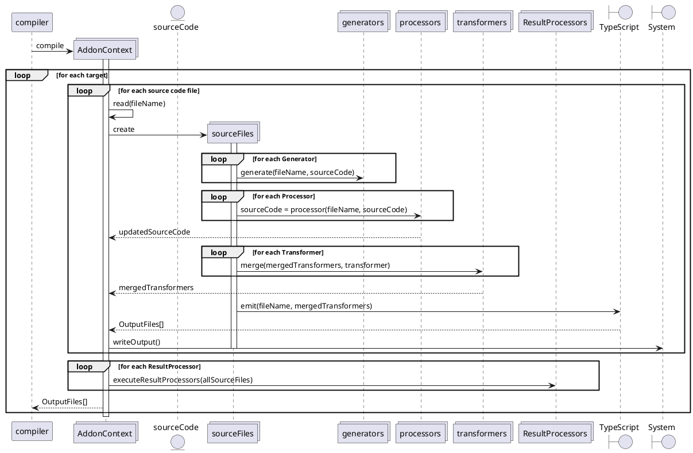

<!--
 ---------------------------------------------------------------------------------------------
   Copyright (c) Quatico Solutions AG. All rights reserved.
   Licensed under the MIT License. See LICENSE in the project root for license information.
 ---------------------------------------------------------------------------------------------
-->

# Write your own addon

The websmith compiler frontend provides an addon API to customize the compilation process of the underlying TypeScript compiler. An addon is an ES module named `addon.ts` or `addon.js` with an exported function named `activate`. The `activate` function takes an `AddonContext` as its only parameter and is called when the compilation process is started. The `AddonContext` provides access to the underlying TypeScript compiler and API to register different kinds of transformers, processors or generators.

All addons must be located in separate folders inside the dedicated *"addons"* directory. The folder name is used as addon name, if no explicit name is provided. The *"addons"* directory should be located in the root of the project, i.e. next to your `tsconfig.json`. The *"addons"* directory is not part of the TypeScript compilation process. You can specify a different location for your addons using the CLI argument `--addonsDir`.

## 1 Different kinds of addons

Depending on the purpose of your addon, you can use generators, processors or transformers. Each of them has different capabilities and is executed at a different point in the compilation process. It's important to understand what kind to use for your purpose:

- `Generators` are executed before everything else and receive an unmodified source file, regardless of how many other generators are executed before. They can create additional source input or other output files that are not processed by the TypeScript compiler. `Generators` cannot alter the source code, giving every Generator the guarantee to receive the unmodified source as created by the developer. `Generators` are executed once per file, before all other processors or transformers.
- `Processors` can consume source files, possibly modified by prior processors, and input files created by `Generators`. They can modify all aspects of an input file, even change module dependencies and modify imports/exports. `Processors` are executed once per file, after all `Generators` but before the standard TypeScript compilation.
- `ResultProcessors` have access to **all** unmodified and transformed source files from the compilation process. They cannot alter the source files, but can consume to the processed source code and compilation results. `ResultProcessors` are executed once per target after the actual compilation is completed.
- `Transformers` can be used to alter the generated JavaScript result during the transpilation. They are merged ("before", "after", "afterDeclarations") and executed together once per file, after the `Processors`. `Transformers` are standard TypeScript [CustomTransformers](https://github.com/microsoft/TypeScript/wiki/Using-the-Compiler-API#traversing-the-ast-with-a-little-linter) that allow you to modify the code as the TypeScript to JavaScript transpilation takes place.

### 1.1 What kind to use?

The following list should help you to decide what kind to use for your purpose:

- Use a `Generator` in your addon, if you need additional input files, or want to make sure you consume unmodified input files, e.g. for a later addon, your bundler, your deployment pipeline or the compiler itself.
- Use a `Processor` in your addon, if you need to modify existing input files or their dependencies before the actual compilation, e.g. to change imports and exports.
- Use a `ResultProcessor` in your addon, if you need to create additional output files based on multiple files, e.g, to generate documentation data.
- Use `Transformers` in your addon, if you need to modify code behavior (what the code does) or when reusing a standard TypeScript transformer.

## 2 Implement a Generator

`Generators` allow you to generate additional information **per file** with the unprocessed input source files and persist them on the system (`ctx.getSystem().writeFile(filePath)`) for other addons that are executed later on (`ctx.getSystem.readFile(filePath)`). You can even add a newly written file to the compilation process with `ctx.addInputFile(filePath)`.

### 2.1 Example Generator

The following example shows how to implement a `Generator` that creates additional input files for the compilation:

```typescript
// ./addons/example-generator/addon.ts
import { AddonContext, InfoMessage } from "@quatico/websmith-api";
import { basename, dirname, extname, join } from "path";

export const activate = (ctx: AddonContext) => {
    ctx.registerGenerator((filePath: string, fileContent: string): void => {
        if (filePath.includes("foo")) {
            const dirName = dirname(filePath);
            const fileName = `${basename(filePath, extname(filePath))}-added.ts`;
            if (!filePath.endsWith("-added.ts")) {
                // Add the additional file to the compilation process.
                ctx.addVirtualFile(join(dirName, fileName), fileContent);
            }

            // Report info message to the console.
            ctx.getReporter().reportDiagnostic(new InfoMessage(`Example generator processing ${fileName}`));
        }
    });
};

```

## 3 Implement a Processor

`Processors` are executed once **per file** after all `Generators` and the TypeScript compilation step. They allow you to alter all aspects of the code, in particular to add or remove imports, functions or dependencies on other modules. While this in theory can be done in `Transformers`, the TypeScript compilation will not be able to resolve such changes anymore yielding failing code when adding module dependencies and incorrect D.TS output files. It is possible to call `ts.transform()` in `Processors` and reuse existing standard `CustomTransformers` in this setup to achieve the desired code transformations.

### 3.1 Example Processor

The following example shows how to implement a `Processor` that modifies the exports of "foobar" functions:

```typescript
// ./addons/example-processor/addon.ts
import { AddonContext } from "@quatico/websmith-api";
import ts from "typescript";

export const activate = (ctx: AddonContext) => {
    ctx.registerProcessor((filePath: string, fileContent: string): string => {
        const sf = ts.createSourceFile(filePath, fileContent, ctx.getConfig().options?.target ?? ts.ScriptTarget.Latest);
        const result = ts.transform(
            sf,
            [
                (context: ts.TransformationContext) => {
                    return (curFile: ts.SourceFile) => {
                        const visitor = (node: ts.Node): ts.VisitResult<ts.Node> => {
                            // Replace non exported foobar function with exported function.
                            if (ts.isFunctionDeclaration(node) && node.name?.text === "foobar") {
                                return ts.factory.updateFunctionDeclaration(
                                    node,
                                    node.decorators,
                                    [ts.factory.createModifier(ts.SyntaxKind.ExportKeyword), ...(node.modifiers ?? [])],
                                    node.asteriskToken,
                                    node.name,
                                    node.typeParameters,
                                    node.parameters,
                                    node.type,
                                    node.body
                                );
                            }
                            return ts.visitEachChild(node, visitor, context);
                        };
                        return ts.visitNode(curFile, visitor);
                    };
                },
            ],
            ctx.getConfig().options
        );
        return ts.createPrinter().printFile(result.transformed[0]);
    });
};

```

## 4 Implement a ResultProcessor

`ResultProcessors` follow the same approach as `Generator` but are executed after the compilation is completed. They are executed once per target, not once per file. A `ResultProcessor` can access the processed source file content, possibly modified by processors with `ctx.getFileContent()`, and the unmodified source file content with `ctx.getSystem().readFile()`. `ResultProcessors` are executed executed only once **per target**, not once **per file**.

### 4.1 Example ResultProcessor

The following example shows how to implement a `ResultProcessor` that creates JSON data with found function names:

```typescript
// ./addons/example-result-processor/addon.ts
import { AddonContext, InfoMessage } from "@quatico/websmith-api";
import { basename, extname, join } from "path";
import ts from "typescript";

export const activate = (ctx: AddonContext) => {
    ctx.registerResultProcessor((filePaths: string[]): void => {
        const result: Record<string, string[]> = {};

        filePaths.forEach(curPath => {
            const content = ctx.getFileContent(curPath);
            const target = ctx.getConfig().options.target ?? ts.ScriptTarget.Latest;

            ts.transform(
                ts.createSourceFile(curPath, content, target),
                [
                    (context: ts.TransformationContext) => (curFile: ts.SourceFile) => {
                        const funcNames: string[] = [];

                        const visitor: ts.Visitor = (node: ts.Node) => {
                            if (ts.isFunctionDeclaration(node) && node.name?.text) {
                                funcNames.push(node.name.text);
                            } else if (ts.isVariableStatement(node)) {
                                const decl = node.declarationList.declarations[0];
                                if (ts.isArrowFunction(decl)) {
                                    funcNames.push(node.declarationList?.declarations[0]?.name?.getText(curFile));
                                }
                            }
                            return ts.visitEachChild(node, visitor, context);
                        };

                        curFile = ts.visitNode(curFile, visitor);
                        result[basename(curPath, extname(curPath))] = funcNames;

                        return curFile;
                    },
                ],
                ctx.getConfig().options
            );
            // Report info message to the console.
            ctx.getReporter().reportDiagnostic(new InfoMessage(`Example result processor: processed "${curPath}"`));
        });

        // Write the result to the output JSON file.
        ctx.getSystem().writeFile(join(ctx.getConfig()?.options?.outDir ?? "", "named-functions.json"), JSON.stringify(result));
    });
};

```

## 5 Implement a Transformer

`Transformers` follow the standard TypeScript API `ts.CustomTransformers`, providing a factory that takes in a `ts.TransformationContext` and returning a Transformer for SourceFiles. A `Transformer` is executed after all `Processors` as part of the standard TypeScript compilation.  While `Processors` are executed one by one, `Transformers` are merged. All **before** of all `Transformers` are executed together, all **after** are executed together and all **afterDeclarations** are executed together. A `Transformer` can modify the source code, but cannot change module dependencies or modify imports/exports.

The official TypeScript has good examples for implementing a transformer, such as the [delint Transformer documentation](https://github.com/microsoft/TypeScript/wiki/Using-the-Compiler-API#traversing-the-ast-with-a-little-linter). Further examples and in-depth explanations for TypeScript code transformation can be found in the [TypeScript Transformer Handbook](https://github.com/madou/typescript-transformer-handbook).

When writing ts.Transform or Transformer based addons, we recommend to use [the AST Explorer](https://astexplorer.net/) and [the TS Creator](https://ts-creator.js.org/) as tools to aid your development.
VisualStudio Code users can leverage the extension [TypeScript AST Explorer](https://marketplace.visualstudio.com/items?itemName=krizzdewizz.vscode-typescript-ast-explorer).

### 5.1 Example Transformer

The following example shows how to implement a `Transformer` that modifies the source code inside a module:

```typescript
// ./addons/example-transformer/addon.ts
import { AddonContext } from "@quatico/websmith-api";
import ts from "typescript";

export const activate = (ctx: AddonContext): void => {
    ctx.registerTransformer({
        before: [
            (context: ts.TransformationContext) => {
                return (sourceFile: ts.SourceFile): ts.SourceFile => {
                    const visitor = (node: ts.Node): ts.VisitResult<ts.Node> => {
                        if (ts.isIdentifier(node)) {
                            const identifier = node.getText();
                            if (identifier.match(/foobar/gi)) {
                                return context.factory.createIdentifier(identifier.replace(/foobar/gi, "barfoo"));
                            }
                        }
                        return ts.visitEachChild(node, visitor, context);
                    };
                    return ts.visitNode(sourceFile, visitor);
                };
            },
        ],
    });
};
```

The same TypeScript TransformerFactories we used in `Processors` and `Generators` can also be used as `Transformer`. Please keep in mind, that `Transformers` are executed after the TypeScript compiler has processed the structure of code and in essence the D.TS file generated. When using a `Transformer` instead of a `Processor`, the resulting transformed JavaScript code will be identical, but the function signatures ("foobar" to "barfoo" from the example above) will not be reflected in the generated D.TS file.

## 6 Addon Context API

### 6.1 Interacting with Websmith: The AddonContext explained

Websmith addons receive the `AddonContext` in the `activate` function. The `AddonContext` provides API for addons to access:

- the file system (`ctx.getSystem()`)
- the current compilation program (`ctx.getProgram()`)
- the reporter (`ctx.getReporter()`)
- the command-line options used to run the compiler (`ctx.getConfig()`)
- the configuration specific for this compilation target (`ctx.getTargetConfig()`)
- the up to date input file content (`ctx.getFileContent(filePath)`)

### 6.2 Error reporting

Websmith uses a `Reporter` to display *"info"*, *"warning"* and *"error"* messages while respecting the current debug option. Access the report with `ctx.getReporter()` from the `AddonContext`. Use the `reportDiagnostic` method to report messages from your addon:

```typescript
export const activate = (ctx: AddonContext) => {
    //...
    ctx.getReporter().reportDiagnostic(new ErrorMessage(`My error message`));
}
```

Websmith provides three message types: `InfoMessage`, `WarnMessage` and `ErrorMessage`, which your addons can use to communicate diagnostic information.

### 6.3 Interacting with the file system

Websmith brings its own file system API to compilation even in the browser environment. **Do not use** the `fs` package for accessing files from your disk, use `ctx.getSystem()` instead. Read the original file content from the file system with `ctx.getSystem().readFile(filePath)` or the processed and potentially modified content with `ctx.getFileContent(filePath)`. Write new files to the file system with `ctx.getSystem().writeFile(filePath, content)`.

## 7 Addon execution flow


